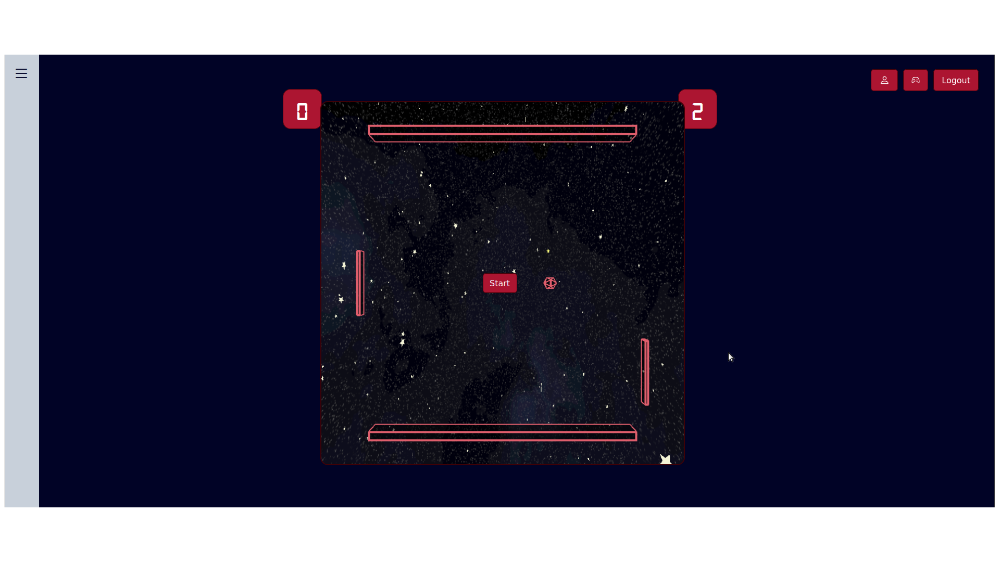

# Transcendence

This is the final project of the 42 Common Core. The goal is to build a fully-featured and interactive web application centered around a real-time multiplayer Pong game.

You can find the project subject [here](./en.subject.pdf).

## Skills Practiced

- Full-stack **web development**
- Backend with **Django** (Python)
- Frontend using **Vanilla JavaScript**
- **Docker** for containerized development and deployment
- Code separation and clean architecture
- Input validation, error handling, and basic security

## Game Preview

Here's a preview of the game:

.